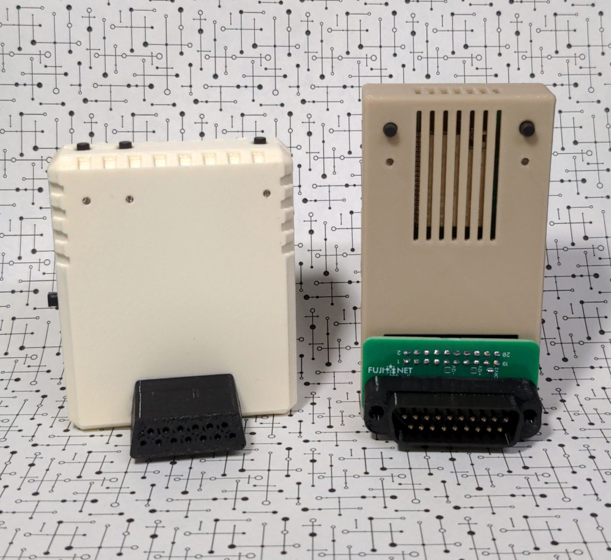

# Welcome to FujiNet!

Welcome to the [FujiNet](https://fujinet.online) project!  

FujiNet is a multi-peripheral emulator and WiFi network device for vintage computers. The first completed hardware was for Atari 8-Bit computers and development has begun for other systems with the goal of supporting as many as possible. What sets FujiNet apart from other WiFi devices is the new Network Device (the N device, or NDEV). The N device allows vintage computers that do not have enough processing power to handle TCP/IP connections talk to the modern internet over WiFi. Virtual adapters have been created for many protocols including: TCP, UDP, HTTP, FTP, TNFS, HTTPS (SSL/TLS), SSH, TELNET, WebDAV and JSON parser. 

The FujiNet project is 100% completely open source, software and hardware. All code and hardware designs are available on our [Github](lhttps://github.com/FujiNetWIFI). Anyone is welcome to join us and add support for any system they want. We are more than willing to help where we can. The best way to get in touch with us is on our [Discord](https://discord.gg/7MfFTvD) server.

## Supported Platforms

- [Atari 8-bit](https://fujinet.online/atari-8-bit/)
- [Apple II & III](https://fujinet.online/apple-ii-iii/)
- [Coleco ADAM](https://fujinet.online/coleco-adam/)
- [Commodore IEC (C64)](https://fujinet.online/commodore-iec/)
- [Tandy Color Computer (CoCo)](https://fujinet.online/tandy-color-computer/)
